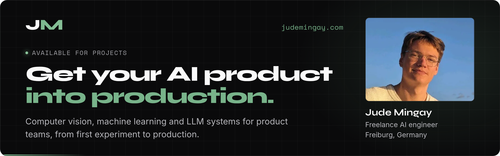
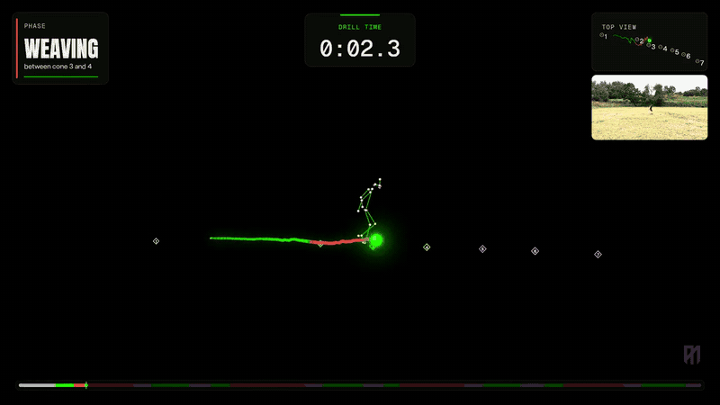
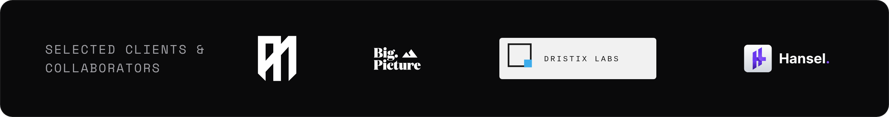

  
  
  

I'm Jude, a freelance AI engineer in Freiburg, Germany. I build computer vision, machine learning, and LLM systems for product teams and take them from experiment to production: data and annotation, models, deployment, and the interface people actually use.

MSc candidate in AI at the University of Freiburg. I work in English, German, and Portuguese, all at native level.

## Recent work: AIM

**[AIM](https://aim.io/)** is an AI football coach. A player films a drill on their phone and gets visual coaching feedback. I built the intelligence layer behind it, from annotation tooling and custom perception to drill understanding, biomechanics, explainable scoring, and the visualization above.

<table>
  <tr>
    <td align="center" width="33%"><h3>1 min → 7 s</h3>Analysis time for one minute of 720p drill footage</td>
    <td align="center" width="33%"><h3>Lean training</h3>The same models, trained on far cheaper hardware</td>
    <td align="center" width="33%"><h3>Commercial-ready</h3>Every shipped model cleared for commercial use</td>
  </tr>
</table>

**[Read the AIM case study →](https://judemingay.com/case-studies/aim)**

> “With his critical thinking and principled engineering approach, we cleaned up a mess and built a sophisticated AI coaching platform from the ground up.”
>
> — **Dristix Labs**, client testimonial

## Work with me

| Engagement | What you get | Length |
|---|---|---|
| **[Sports AI Feasibility Sprint](https://judemingay.com/services/sports-ai-feasibility-sprint)** | Find out whether your footage and data can support the product. I review the data, test the riskiest component, and map out the architecture and next steps. | 1–2 weeks |
| **[AI Pipeline Performance Audit](https://judemingay.com/services/ai-pipeline-performance-audit)** | Find what is costing you accuracy, time, or money. I benchmark the pipeline and prioritize improvements to the models, infrastructure, and deployment. | 1–3 weeks |
| **[End-to-End AI Product Build](https://judemingay.com/services/end-to-end-ai-product-build)** | One technical owner from data and annotation through models, integration, and production, with monitoring, documentation, and team handoff. | Scoped to your product |

Working outside sports, or unsure where to start? [Tell me about your AI problem](https://judemingay.com/?contact=open&source=github#contact). I reply personally within one business day.

## Selected projects

| Project | What it is | Focus |
|---|---|---|
| **[AIM](https://judemingay.com/case-studies/aim)** | AI football coach: the full intelligence layer, from annotation tooling to production | Computer vision, pose, temporal ML, biomechanics |
| **[Hansel](https://hansel.group/)** | Specialized, fine-tuned models replacing general LLM calls where they are faster, cheaper, and more accurate for an enterprise AI product | Fine-tuning, classifiers, LLM systems |
| **[FiscFox](https://github.com/judeam/FiscFox)** | Privacy-first German tax management with local AI, ML forecasting, and OCR | FastAPI, TabPFN, Ollama |
| **[FledgePower](https://lfenergy.org/projects/fledgepower/)** | Multi-protocol gateway for power grid interoperability (LF Energy, open source) | IEC 61850, TASE.2, IEC 104, C/C++ |
| **[StepMaker](https://github.com/2002Bishwajeet/stepmaker)** | Turns CAD assemblies into multilingual work instructions with a 3D viewer | Next.js, Three.js, FastAPI |
| **[Greenvisor](https://greenvisor.vercel.app)** | Cyclic RAG advisor for German home energy efficiency using knowledge graphs | LangChain, Neo4j, FastAPI |
| **[HPO4TabPFN](https://judemingay.com/projects/hpo4tabpfn)** | Research: compact TabPFN configurations and optimizers. Smaller, deeper models performed strongly and Muon led the tested optimizers | TabPFN, NePS, Muon |
| **[AutoML Text Classifier](https://judemingay.com/projects/automl-text-classifier)** | Research: architecture-agnostic optimizer selection with proxy search spaces | DEHB, NePS, LSTM |

## Tech

  
  
  
  
  
  
  
  
  
  
  

- **ML & AI:** PyTorch, computer vision (detection, segmentation, pose, tracking), YOLO, transformers, temporal ML, time series, fine-tuning, RAG, LLM integration
- **Inference & MLOps:** TensorRT, CUDA, ONNX, Triton Inference Server, Docker, FastAPI, GCP, Weights & Biases, vector databases
- **AutoML & research:** hyperparameter optimization, neural architecture search, meta-learning, TabPFN, synthetic data
- **Languages:** Python, C/C++, Java, C#/.NET, SQL
- **Industrial protocols:** IEC 61850, IEC 60870, ICCP TASE.2

## Experience

- **AI Lead (Contract)** · Big Picture Software · Nov 2025 – present
- **ML Engineer (Contract)** · Big Picture Software · Apr – Nov 2025
- **Software Engineer** · MZ Automation GmbH, Freiburg · May 2024 – Mar 2025
- **Junior Software Engineer** · Gridcore Labs, Portugal · Jul 2023 – Apr 2024
- **Research Assistant** · Universidade do Algarve, Portugal · Mar – Jul 2023

## Get in touch

Tell me what you're working on at **[judemingay.com](https://judemingay.com/?contact=open&source=github#contact)** or connect on **[LinkedIn](https://linkedin.com/in/judemingay)**.
